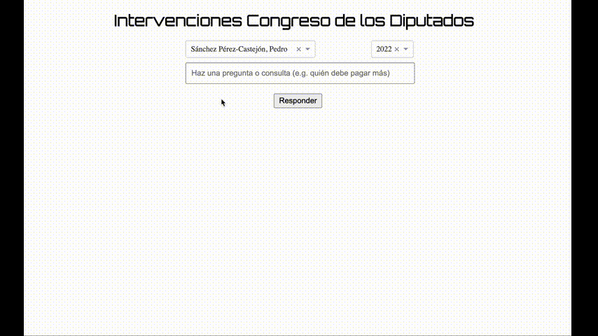

# web-file

Web-file scrapes information from internet and allows the user to ask and be answered from the data extracted. 


## Installing

1. Build directories

```sh
make build_folders
```

2. Create virtual env:

```sh
make env
```

3. Activate virual env

```sh
source .venv/bin/activate 
```

4. Upgrade pip

```sh
source python -m pip install --upgrade pip
```

5. Install dependencies
```sh
python -m pip install -r requirements.txt
```

## Dependencies

### 1. Installing QA Model

https://huggingface.co/deepset/minilm-uncased-squad2

```sh
git lfs install
git clone https://huggingface.co/deepset/minilm-uncased-squad2
```

### 2. Installing Docker

https://docs.docker.com/desktop/install/mac-install/

### 3. Installing Haystack

https://pypi.org/project/farm-haystack/

```sh
git clone https://github.com/deepset-ai/haystack.git
cd haystack
```

For Mac M1:

```sh
brew install postgresql
brew install cmake
brew install rust

# haystack installation
GRPC_PYTHON_BUILD_SYSTEM_ZLIB=true pip install git+https://github.com/deepset-ai/haystack.git
```
## Demo

```sh
docker-compose up
docker-compose run webfile python -m scripts.store_transcripts_to_elastic
docker-compose up -d
```

https://learn.microsoft.com/es-es/azure/container-instances/tutorial-docker-compose
https://docs.docker.com/cloud/aci-integration/


