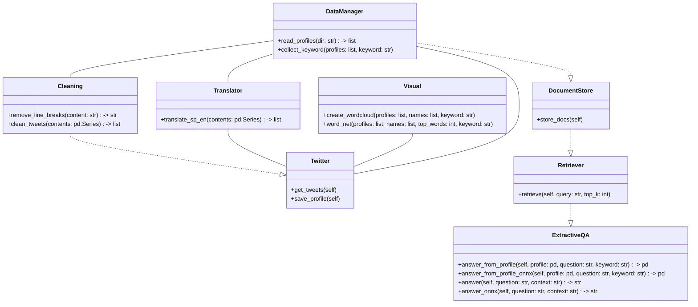

```mermaid
classDiagram

    Cleaning ..|> Twitter
    Translator -- Twitter
    Visual -- Twitter
    DataManager -- Twitter
    DataManager -- Cleaning
    DataManager -- Translator
    DataManager ..|> DocumentStore
    DocumentStore ..|> Retriever
    Retriever ..|> ExtractiveQA


    class Twitter{
        +get_tweets(self)
        +save_profile(self)
    }

    class Translator{
        +translate_sp_en(contents: pd.Series) -> list
    }

    class Visual{
        +create_wordcloud(profiles: list, names: list, keyword: str)
        +word_net(profiles: list, names: list, top_words: int, keyword: str)
    }

    class Cleaning{
        +remove_line_breaks(content: str) -> str
        +clean_tweets(contents: pd.Series) -> list
    }

    class DataManager{
        +read_profiles(dir: str) -> list
        +collect_keyword(profiles: list, keyword: str)
    }

    class ExtractiveQA{
        +answer_from_profile(self, profile: pd, question: str, keyword: str) -> pd
        +answer_from_profile_onnx(self, profile: pd, question: str, keyword: str) -> pd
        +answer(self, question: str, context: str) -> str
        +answer_onnx(self, question: str, context: str) -> str
    }

    class Retriever{
        +retrieve(self, query: str, top_k: int)
    }

    class DocumentStore{
        +store_docs(self)
    }
```